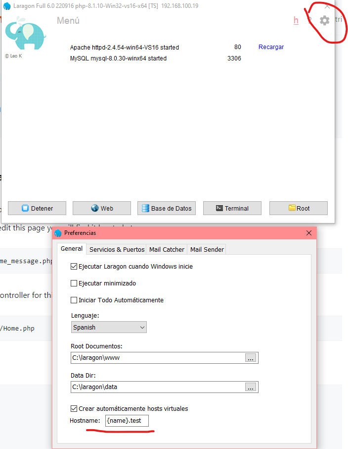
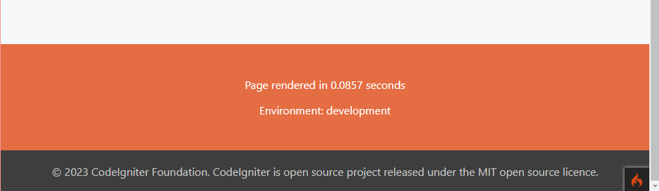
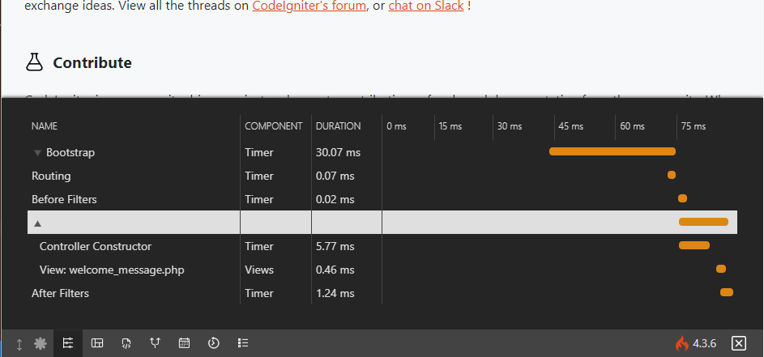
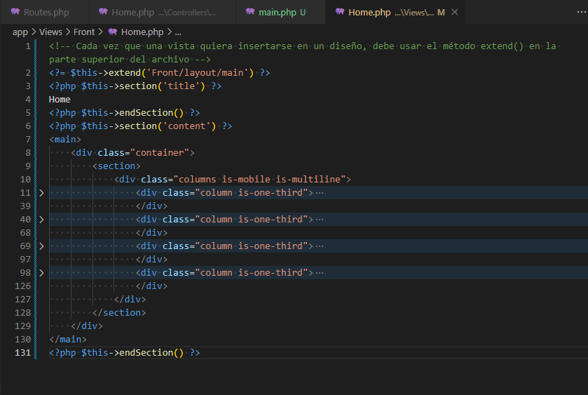
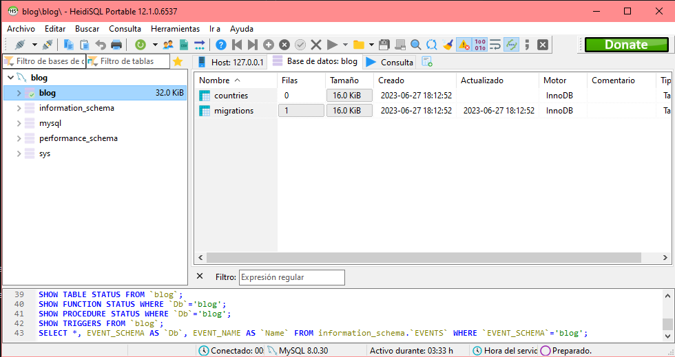
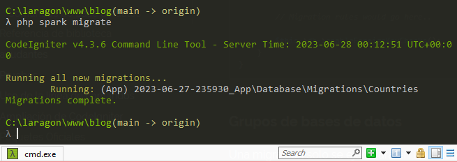
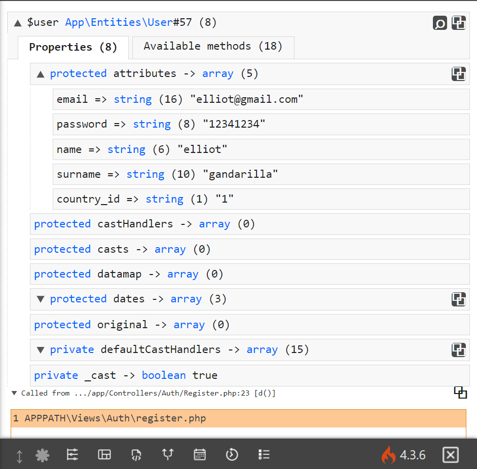

# Codeigniter 4

[Curso CI 4](https://www.youtube.com/watch?v=ugs1_dvzfSY&list=PLQBsSZ4qJdGm-6HlrHB0H2xyCCmSPTJqo&index=2)

## 2-. instalación

Inciamos con Laragon, tras descargarlo vamos a la terminal y ejecutamos el comando de composer para realizar la instalación, esto lo hacemos siguiendo los pasos del siguiente [link](https://www.codeigniter.com/user_guide/installation/installing_composer.html)

Posterior a esto iniciamos los servicios de Laragon para crear nuestros virtual hosts
Inciamos y verificamos la ruta en el engranaje, en Hostname podemos ver el nombre del host virtual



### Virtual Hosts

En el contexto de Laragon, un virtual host se refiere a una configuración que te permite asignar un nombre de dominio local a un proyecto específico en tu entorno de desarrollo. Básicamente, te permite acceder a un proyecto en tu máquina local utilizando un nombre de dominio personalizado en lugar de la típica ruta de acceso del proyecto.

Cuando configuras un virtual host, puedes acceder a tu proyecto local utilizando una URL como "http://mi-proyecto.local" en lugar de algo como "http://localhost/mi-proyecto". Esto puede ser útil para simular un entorno de producción local y facilitar el desarrollo y la prueba de proyectos que requieren nombres de dominio específicos.

Laragon es una herramienta de desarrollo local que simplifica la configuración y administración de servidores web en tu máquina. Proporciona un entorno de desarrollo completo con Apache, PHP, MySQL y otras herramientas relacionadas. Al utilizar Laragon, puedes configurar y administrar fácilmente virtual hosts para tus proyectos.

## 3-. Primeras Configuraciones

En la estructura del proyecto podemos ver un archivo env. Todos los frameworks modernos tiene un archivo env, se encarga de las variables de configuración que pueden cambiar cuando subimos nuestro sitio a producción o cuando hacemos testing de la app verificando varios parametros como la DB, BaseUrl (el cual cambia entre desarrollo y producción)

CI nos proporciona este template y de momento realizaremos ciertas configuraciones

```conf
# ENVIRONMENT
#--------------------------------------------------------------------

# CI_ENVIRONMENT = production
CI_ENVIRONMENT = development

#--------------------------------------------------------------------
# APP
#--------------------------------------------------------------------

app.baseURL = 'http://blog.test/'
# If you have trouble with `.`, you could also use `_`.
# app_baseURL = ''
# app.forceGlobalSecureRequests = false
# app.CSPEnabled = false
```

- CI_ENVIRONMENT cambiamos a development
- app.baseURL escribimos la ruta de nuestro host virtual

Posteriormente agregamos un . al archivo env para que lo tome como configuración e ignoramos el archivo en la carpeta gitignore

En nuestro index de CI podremos ver en que entorno estamos


Al estar en development podemos acceder a ciertas herramientas



Aqui podemos ver en que vista estamos, los tiempos de carga de los archivos, los archivos que se obtienen, las rutas, los eventos, un historial de peticiones y por último las variables que recibimos al cargar la vista, variables de sesión, consultas, etc.

## 4-. [Controladores y PSR-4](https://www.codeigniter.com/user_guide/incoming/controllers.html)

Dentro de app\Controllers almacenaremos nuestros controlador.
Contamos con un BaseController que pertenece al core de CI. Aqui podemos cargar helpers, podemos pre cargar modelos, librerías, etc.

Además tenemos un Controlador Home.php que nos muestra la bienvenida de CI

### PSR-4

Estandar definido por la comunidad el cual ayuda a la carga de archivos (en PHP nativo se refiere a include/require), esto lo haremos haciendo uso de los namespace. CI utiliza la carga de archivos automatica con el objetivo de conastruir apps más modulares. Nosotros podemos llamar a otros modulos simplemente definiendo su namespace, estos namespaces los vemos en app\Config\Autoload.php

Un ejemplo de esto:

Creamos una archivo en la siguiente ruta: app\Libraries\Codigo.php
Dentro de este archivo generaremos un namespace y una clase

```php
namespace App\Libraries;

class Codigo
{
    public function sayHi()
    {
        return "hi";
    }
}
```

Ahora en nuestro Controlador Home haremos uso de este método de la siguiente manera

```php
namespace App\Controllers;
// Importamos la clase codigo
use App\Libraries\Codigo;

class Home extends BaseController
{
    public function index()
    {
        // Instanciamos un objeto de esta clase
        $instancia_codigo = new Codigo();
        // Llamamos al método
        echo $instancia_codigo->sayHi();
        return view('welcome_message');
    }
}
```

De esta manera podemos crear modulos y utilizarlos en cualquier parte de nuestra aplicación, facilitando el uso de componentes y agilizando el desarollo

## 5-. [Rutas](https://www.codeigniter.com/user_guide/incoming/routing.html)

La definición de las rutas las encotramos en app\Config\Routes.php
Tenemos dos tipos de enrutamiento. Uno es Enrutamiento de ruta definida y el otro es Enrutamiento automático . Con Enrutamiento de ruta definida, puede definir rutas manualmente. Permite URL flexible. El enrutamiento automático enruta automáticamente las solicitudes HTTP según las convenciones y ejecuta los métodos de controlador correspondientes. No hay necesidad de definir rutas manualmente.

Cuando especifica una ruta, elige un método correspondiente a los verbos HTTP (método de solicitud). Si espera una solicitud GET, utilice el get()método:

Configuración de reglas de enrutamiento

```php
$routes->get('/', 'Home::index');
```

Una ruta toma la ruta de ruta (ruta URI relativa a la URL base /) a la izquierda y la asigna al controlador de ruta (controlador y método Home::index) a la derecha, junto con los parámetros que deben pasarse al controlador.

Si ese método requiere que se le pasen parámetros, se enumerarán después del nombre del método, separados por barras diagonales:

```php
// Calls $Users->list()
$routes->get('users', 'Users::list');

// Calls $Users->list(1, 23)
$routes->get('users/1/23', 'Users::list/1/23');
```

Una URL con producto como primer segmento y un número en el segundo se asignará a la \App\Controllers\Catalogclase y el método productLookupByID() pasará la coincidencia como una variable al método:

```php
$routes->get('product/(:num)', 'Catalog::productLookupByID/$1');
```

Rutas de verbos HTTP
Puede usar cualquier verbo HTTP estándar (GET, POST, PUT, DELETE, OPTIONS, etc.):

```php
$routes->post('products', 'Product::feature');
$routes->put('products/1', 'Product::feature');
$routes->delete('products/1', 'Product::feature');
```

Ver Rutas

Si solo desea representar una vista que no tiene lógica asociada, puede usar el view()método. Esto siempre se trata como una solicitud GET. Este método acepta el nombre de la vista a cargar como segundo parámetro.

```php
// Displays the view in /app/Views/pages/about.php
$routes->view('about', 'pages/about');
Si usa marcadores de posición dentro de su ruta, puede acceder a ellos dentro de la vista en una variable especial, $segments. Están disponibles como una matriz, indexados en el orden en que aparecen en la ruta.
```

```php
// Displays the view in /app/Views/map.php
$routes->view('map/(:segment)/(:segment)', 'map');

// Within the view, you can access the segments with
// $segments[0] and $segments[1] respectively.
```

Agrupamientos

Podemos agrupar rutas bajo un nombre en común, esto con el método group(). El nombre del grupo se convierte en un segmento que aparece antes de las rutas definidas dentro del grupo. Esto le permite reducir la escritura necesaria para crear un amplio conjunto de rutas que comparten la cadena de apertura, como cuando se crea un área de administración:

```php
// Podemos agrupar rutas bajo un nombre común
// El prefijo aparecerá antes de cada ruta definida
// dentro de los corchetes podemos definir un namespace (en donde buscará los controladores)
$routes->group('home', ["namespace" => "App\Controllers\Front"], function ($routes) {
    $routes->get('/', 'Home::index');
    $routes->get('/libreria', 'Home::sayHola');
});
```

Con esto nuestra ruta quedaría de la siguiente manera
"http://blog.test/home"
Y se estará renderizando el método index

## 6-. Vistas

Generamos vistas en la carpeta app\Views y las renderizamos en el controlador con el método view();
Es preferible agrupar las vistas en carpetas para tener un mayor orden

## 7-. [Layouts](https://www.codeigniter.com/user_guide/outgoing/view_layouts.html?highlight=rendersection)

Los Layouts nos sirven para modularizar y reutilizar elementos en diferentes vistas
Vamos a separar el header y el footer, además tendremos un main que renderizará todo el contenido HMTL

En nuestro archivo main vamos a incluir el header y el footer con el método:

```php
    $this->include();
```

El cual carga elementos **estaticos**
Sin embargo, el contenido y el title del documento es algo dinamico, por tanto, usaremos el método:

```php
    $this->renderSection();
```

El cual tendrá que especificarse en cada vista

En este mismo archivo podemos incluir las hojas de estilos y archivos js que necesitemos en todas las vistas. Este es el resultado de nuestro main.php

```html
<!DOCTYPE html>
<html>
  <head>
    <meta charset="utf-8" />
    <meta name="viewport" content="width=device-width, initial-scale=1" />
    <title><?= $this->renderSection('title') ?></title>
    <!-- Bulma -->
    <link
      rel="stylesheet"
      href="https://cdn.jsdelivr.net/npm/bulma@0.9.4/css/bulma.min.css"
    />
  </head>

  <body>
    <!-- Busca a partir de la carpeta Views -->
    <?= $this->include('Front/layout/header.php') ?>
    <!-- renderSection actúa como un marcador de posición para el contenido -->
    <?= $this->renderSection('content') ?>
    <?= $this->include('Front/layout/footer.php') ?>
  </body>
</html>
```

Ahora en nuestra vista home.php vamos a definir los contenidos dinamicos


- En la parte de arriba usamos el método extend() para traer ese layout
- Ahora entre los métodos section y endSection especificamos el nombre de la sección dinamica y su contenido:
  ```php
    <?php $this->section('title') ?>
    Home
    <?php $this->endSection() ?>
  ```

Con esto estaremos reutilizando layouts en nuestras vistas, obteniendo archivos HTML estaticos y también renderizando estructuras dinamicas

## 8-. [Migraciones](https://www.codeigniter.com/user_guide/dbmgmt/migration.html)

Las migraciones son una forma conveniente de modificar su base de datos de manera estructurada y organizada. Podría editar fragmentos de SQL a mano, pero luego sería responsable de decirles a otros desarrolladores que necesitan ir y ejecutarlos. También tendría que realizar un seguimiento de los cambios que deben ejecutarse en las máquinas de producción la próxima vez que implemente.

Las migraciones de la tabla de la base de datos rastrean qué migraciones ya se han ejecutado, por lo que todo lo que tiene que hacer es asegurarse de que sus migraciones estén en su lugar y llamar $migration->latest()para actualizar la base de datos al estado más reciente. También puede usar $migration->setNamespace(null)->latest()para incluir migraciones de todos los espacios de nombres.

Las migraciones se almacenan en la ruta: app/Database/Migrations/

Para crear una migración por terminal de comandos en Laragon escribiremos los siguientes comandos:

```CLI
php spark make:migration
```

Posterior a esto escrbiremos el nombre de la clase y tendremos nuestro archivo creado:

```php
namespace App\Database\Migrations;

use CodeIgniter\Database\Migration;

class Countries extends Migration
{
    public function up()
    {
        //
    }

    public function down()
    {
        //
    }
}
```

- El metodo up sirve para crear nuestra tabla
- El metodo down sirve para las instrucciones de eliminar o hacer un rollback de la tabla

Ahora, en nuestro administrador de Laragon crearemos una DB en blanco antes de trabajar con las Migraciones:



En nuestro archivo .env especificamos los datos de la DB

```conf
 database.default.hostname = localhost
 database.default.database = blog
 database.default.username = root
 database.default.password =
 database.default.DBDriver = MySQLi
```

Una vez que definamos la estructura de nuestra tabla en la migración dentro de los métodos up() y down() creamos la migración en la terminal de laragon con el comando

```CLI
php spark migrate
```

Si todo sale correcto obtendremos lo siguiente:



Con esto habremos creado nuestra tabla

## 9-. [Foreign Keys](https://www.codeigniter.com/user_guide/dbmgmt/forge.html?highlight=foreignkey#CodeIgniter\Database\Forge::addForeignKey)

Para agregar las llaves foraneas haremos uso del método addForeignKey():

```php
$this->forge->addForeignKey('users_id', 'users', 'id', 'CASCADE', 'CASCADE');
// gives CONSTRAINT `my_fk_name` FOREIGN KEY(`users_id`) REFERENCES `users`(`id`) ON DELETE CASCADE ON UPDATE CASCADE
```

Al actualizar nuestras migraciones tendremos que hacer un refresh para que los cambios surjan efecto, eso lo realizamos con el siguiente comando:

```CLI
php spark migrate:refresh
```

En caso de error debemos verificar que los atributos de la llave foranea deben estar identicos a la llave primaria de la otra tabla, también debemos tener cuidado en el ordene en el que se refrescan las migraciones

## 10-. [Seeders con faker](https://www.codeigniter.com/user_guide/dbmgmt/seeds.html?highlight=seeder)

Database seeding es una forma sencilla de agregar datos a su base de datos. Es especialmente útil durante el desarrollo en el que necesita llenar la base de datos con datos de muestra contra los que puede desarrollar, pero no se limita a eso. Seeder s puede contener datos estáticos que no desea incluir en una migración, como países o tablas de codificación geográfica, eventos o información de configuración, y más.

Crearemos un seeder con spark, para eso escribiremos el siguiente comando:

```CLI
php spark make:seeder
```

Los seeders se alojan en app\Database\Seeds
Para hacer esto haremos uso de [fakerphp](https://github.com/fzaninotto/Faker), el cual ya viene integrado en CI4, esto lo podemos verificar en composer.json

```php
    "require-dev": {
        "fakerphp/faker": "^1.9",
    }
```

Ahora generaremos nuestro script en el archivo seeder

```php
$countries = [];

for ($i = 0; $i < 15; $i++) {
    $created_at = $faker->dateTime();
    $updated_at = $faker->dateTimeBetween($created_at);
    $countries[] = [
        "name" => $faker->country,
        "created_at" => $created_at->format('Y-m-d H:i:s'),
        "updated_at" => $updated_at->format('Y-m-d H:i:s')
    ];
}
```

Tras generar el script para crear nuestros datos fake ahora utilizaremos el siguiente comando para verificarlos en la terminal

```CLI
php spark db:seed InitSeeder
```

## 11-. [Nesting Seeders](https://www.codeigniter.com/user_guide/database/query_builder.html?highlight=query%20builder#insertbatch)

CodeIgniter le da acceso a una clase de Query Builder. Este patrón permite que la información se recupere, inserte y actualice en su base de datos con un mínimo de secuencias de comandos. En algunos casos, solo se necesitan una o dos líneas de código para realizar una acción de base de datos. CodeIgniter no requiere que cada tabla de la base de datos sea su propio archivo de clase. En cambio, proporciona una interfaz más simplificada.

Query Builder se carga a través del método en la conexión de la base de datos . Esto establece la parte DESDE de la consulta por usted y devuelve una nueva instancia de la clase Query Builder:table()

```php
$builder = $db->table('users');
```

Query Builder solo se carga en la memoria cuando solicita específicamente la clase, por lo que no se utilizan recursos de forma predeterminada.

Hacemos uso de nuestro query builder haciendo referencia a la tabla a insertar
Posteriormente usamos el método insertBatch para insertar múltiples datos

```php
// use the factory to create a Faker\Generator instance
$faker = Factory::create();
// Declaramos un array que contendrá los datos
$countries = [];

for ($i = 0; $i < 15; $i++) {
    $created_at = $faker->dateTime();
    $updated_at = $faker->dateTimeBetween($created_at);
    $countries[] = [
        "name" => $faker->country,
        "created_at" => $created_at->format('Y-m-d H:i:s'),
        "updated_at" => $updated_at->format('Y-m-d H:i:s')
    ];
}
// d es como un vardump pero proporcionado por CI
// d($countries);

// Usando un query builder hacemos referencia a la tabla countries
$builder = $this->db->table('countries');

// Con el método insertBatch generamos un insert múltiple de un array
$builder->insertBatch($countries);
```

También podemos crear seeder independientes y llamarlos desde un seeder main, para tener un mejor orden.

## [Entidades parte 1](https://www.codeigniter.com/user_guide/models/entities.html?highlight=entities)

CodeIgniter admite clases de Entidad como un ciudadano de primera clase en su capa de base de datos, al tiempo que mantiene su uso completamente opcional. Se usan comúnmente como parte del patrón Repositorio, pero se pueden usar directamente con el Modelo si se ajusta mejor a sus necesidades.

Dado que no hay una ubicación predeterminada para almacenar estas clases y no encaja con la estructura de directorios existente, cree un nuevo directorio en app/ Entities . Cree la propia Entidad en app/ Entities /User.php .

```php
namespace App\Entities;

use CodeIgniter\Entity\Entity;

class User extends Entity
{
    // ...
}

```

Simulando un inicio de sesión en el controlador Register.php seteamos la entidad con los datos del POST simulado

```php
namespace App\Controllers\Auth;

use App\Controllers\BaseController;
use App\Entities\User;

class Register extends BaseController
{
    public function index()
    {
        // Simulando un POST
        $data = [
            'email' => 'elliot@gmail.com',
            'password' => '12341234',
            'name' => 'elliot',
            'surname' => 'gandarilla',
            'country_id' => '1',
        ];
        // Instanciamos la entidad pasando los datos del form
        $user = new User($data);
        // Imprimimos lo que arroja la entidad
        d($user);
        return view('Auth/register');
    }

    public function store()
    {
        return view('');
    }
}
```



Aqui podemos ver que la entidad ya obtiene los datosd el formulario, además de sus métodos y propiedades propios

## 13-. Entidades Parte 2

En la entidad hacemos uso de los date Mutators, de forma predeterminada, la clase Entity convertirá los campos denominados created_at , updated_at o delete_at en instancias de tiempo cada vez que se establezcan o recuperen.
Además de usar la lógica de negocio, con ayuda de los métodos set y get retornando el atributo aplicando cualquier lógica comercial o conversión de datos que necesite.
Con todo esto podremos devoler los datos en el controlador de la manera en que deseemos.

## 14-. [Modelos](https://www.codeigniter.com/user_guide/models/model.html#id3)

El modelo de CodeIgniter proporciona características convenientes y funcionalidades adicionales que las personas usan comúnmente para que trabajar con una sola tabla en su base de datos sea más conveniente.

Viene listo para usar con métodos de ayuda para muchas de las formas estándar en las que necesitaría interactuar con una tabla de base de datos, incluida la búsqueda de registros, la actualización de registros, la eliminación de registros y más.

La clase modelo tiene algunas opciones de configuración que se pueden configurar para permitir que los métodos de la clase funcionen sin problemas para usted. Los dos primeros son usados ​​por todos los métodos CRUD para determinar qué tabla usar y cómo podemos encontrar los registros requeridos:

En nuestro controlador tenemos diferentes maneras de acceder a un modelo, las cuales son.

```php
// Create a new class manually.
$userModel = new \App\Models\UserModel();

// Create a shared instance of the model.
$userModel = model('UserModel');
// or
$userModel = model('App\Models\UserModel');
// or
$userModel = model(App\Models\UserModel::class);
```

Una vez instanciado nuestro objeto tendremos que insertar la data, para esto consultamos los métodos disponibles en la [documentación](https://www.codeigniter.com/user_guide/models/model.html#working-with-query-builder)

## 15-. Archivos de Configuración

Acualmente en nuestro controlador obtenemos los datos POST de la siguiente manera

```php
        $data = [
            'email' => 'elliot@gmail.com',
            'password' => '12341234',
            'name' => 'elliot',
            'surname' => 'gandarilla',
            'group' => '2',
            'country_id' => '1',
        ];
```

Sin embargo no queremos asignar manualmente el grupo (que en este caso sería siempre el id 2), por tanto, podemops manejar esto en el archivo .env o a través de la creación de un [archivo de configuración](https://www.codeigniter.com/user_guide/general/configuration.html#creating-configuration-files)

Cuando necesite una nueva configuración, primero cree un nuevo archivo en la ubicación deseada. La ubicación de archivo predeterminada (recomendada para la mayoría de los casos) es app/Config . La clase debe usar el espacio de nombres apropiado y debe extenderse CodeIgniter\Config\BaseConfigpara garantizar que pueda recibir configuraciones específicas del entorno.

En nuestro caso del group:

```php
namespace Config;

use CodeIgniter\Config\BaseConfig;

class CustomBlog extends BaseConfig
{
    public $default_group_users  = 'user';
}
```

Posteriormente accedemos a nuestro archivo de configuración en el controlador para hacer uso de él, como ayuda imprimimos el valor

```php
class Register extends BaseController
{
    protected $configs;

    public function __construct()
    {
        // Creamos un constructor y utilizamos el méotodo config con el nombre de la custom config para acceder a nuestro campo
        $this->configs = config('CustomBlog');
    }
    public function index()
    {
        // Simulando un POST
        $data = [
            'email' => 'elliot@gmail.com',
            'password' => '12341234',
            'name' => 'elliot',
            'surname' => 'gandarilla',
            'country_id' => '1',
        ];
        // Instanciamos la entidad pasando los datos del form
        $user = new User($data);
        // invocamos el método setUsername
        $user->setUsername();
        // Imprimimos lo que arroja la entidad
        d($user);
        // Imprimimos lo que arroja el CustomBlog
        d($this->configs);
        // Acedemos al modelo UsersModel instanciandolo
        $userModel = new \App\Models\UserModel();
        // Usamos el método save para insertar los datos a la tabla
        $userModel->save($user);
        return view('Auth/register');
    }
}
```

Posterior a esto creamos un modelo para obtener el id de ese valor

```php
    protected $assignGroup;

    // Creamos un modelo para obtener el id del grupo
    public function withGroup($group)
    {
        $row = $this->db->table('groups')->where('name_group', $group)->get()->getFirstRow();
        d($row);

        if ($row !== null) {
            $this->assignGroup = $row->group_id;
        }
    }
```

Por último accedemos al método del modelo para obtener el id en el controlador

```php
class Register extends BaseController
{
    protected $configs;

    public function __construct()
    {
        // Creamos un constructor y utilizamos el méotodo config con el nombre de la custom config para acceder a nuestro campo
        $this->configs = config('CustomBlog');
    }
    public function index()
    {
        // Simulando un POST
        $data = [
            'email' => 'elliot@gmail.com',
            'password' => '12341234',
            'name' => 'elliot',
            'surname' => 'gandarilla',
            'country_id' => '1',
        ];
        // Instanciamos la entidad pasando los datos del form
        $user = new User($data);
        // invocamos el método setUsername
        $user->setUsername();
        // Imprimimos lo que arroja la entidad
        d($user);
        // Imprimimos lo que arroja el CustomBlog
        d($this->configs);
        // Acedemos al modelo UsersModel instanciandolo
        $userModel = new \App\Models\UserModel();
        // Accedemos al método withGroup y pasamos como parametro el valor que se obtiene en $this->configs->default_group_users
        d($userModel->withGroup($this->configs->default_group_users));
        // Usamos el método save para insertar los datos a la tabla
        $userModel->save($user);
        return view('Auth/register');
    }
}
```

## 16-. Callbacks

Para agregar el grupo a nuestro controlador con ayuda del archivo de configuración y el Model necesitaremos hacer uso de los Model Events y de las Callbacks

Model Events
Hay varios puntos dentro de la ejecución del modelo en los que puede especificar múltiples métodos **callback** para ejecutar. Estos métodos se pueden usar para normalizar datos, codificar contraseñas, guardar entidades relacionadas y mucho más. Los siguientes puntos en la ejecución del modelo pueden verse afectados, cada uno a través de una propiedad de clase: $beforeInsert, $afterInsert, $beforeInsertBatch, $afterInsertBatch, $beforeUpdate, $afterUpdate, $beforeUpdateBatch, $afterUpdateBatch, $afterFindy $afterDelete.

Definición de callbacks
Usted especifica las callbacks creando primero un nuevo método de clase en su modelo para usar. Esta clase siempre recibirá un array $data como su único parámetro. El contenido exacto de la array $data variará según los eventos, pero **siempre contendrá una clave llamada data** que contiene los datos primarios pasados ​​al método original. En el caso de los métodos insert* o update*, serán los pares clave/valor que se están insertando en la base de datos. La matriz principal también contendrá los otros valores pasados ​​al método y se detallarán más adelante. El método de devolución de llamada debe devolver la matriz $data original para que otras callbacks tengan la información completa.

Ej:

```php
namespace App\Models;

use CodeIgniter\Model;

class MyModel extends Model
{
    // Método hasPassword que recibe $data
    protected function hashPassword(array $data)
    {
        // el la clave data validamos que venga el password
        if (! isset($data['data']['password'])) {
            return $data;
        }
        // Si viene el password creamos un nuevo campo llamado password_hash donde hasheamos el campo passwrod
        $data['data']['password_hash'] = password_hash($data['data']['password'], PASSWORD_DEFAULT);
        // Eliminamos el campo password
        unset($data['data']['password']0);
        // Por último retornamos la data
        return $data;
    }
}
```

Especificación de devoluciones de llamada para ejecutar
Usted especifica cuándo ejecutar las devoluciones de llamada agregando el nombre del método a la propiedad de clase adecuada ( $beforeInsert, $afterUpdate, etc.). Se pueden agregar varias devoluciones de llamada a un solo evento y se procesarán una tras otra. Puede usar la misma devolución de llamada en múltiples eventos:

```php
namespace App\Models;

use CodeIgniter\Model;

class MyModel extends Model
{
    protected $beforeInsert = ['hashPassword'];
}
```

En nuestro código primero especificamos cuando se ejecutará nuestra callback

```php
    // Especificamos en que momento se ejecutará la callback
    protected $beforeInsert = ['addGroup'];
```

Para posteriormente crear la callback

```php
    // Creamos un modelo para nuestro callback
    public function addGroup($data)
    {
        // Modificamos la data agregando un campo group con el valor de assignGroup
        // Independientemente del contenido de $data siempre habrá una clave data que contiene los datos primarios
        $data['data']['group'] = $this->assignGroup;
        // Retornamos la variable $data
        return $data;
    }
```

Una vez hecho esto, antes de un insert se va a ejectuar nuestra callback addGroup y asignará el valor del group

## 17-. Guardar Tablas Relacionadas

Crearemos un flujo para setear la información en la segunda tabla. Hasta el momento solo insertamos datos en la tabla Users, sin embargo, un par de datos de ese mismo POST se deben insertar en la tabla info_users, para esto haremos uso de las entidades y del Modelo junto con sus callbacks.

Primero creamos una entidad para aplicar un date Mutator a los campos "created_at" y "updated_at"

```php
namespace App\Entities;

use CodeIgniter\Entity\Entity;

class UserInfo extends Entity
{
    // Hacemos uso de un date Mutator
    protected $dates = ['created_at', 'updated_at'];
}
```

Posteriormente la invocamos en el Controlador y le pasamos los datos

```php
    // Instanciamos UserInfo y le pasamos los datos
    $userInfo = new UserInfo($data);
```

Ahora crearemos un modelo que haga referencia a la segunda tabla (info_users) para posteriormente hacer un insert a dicha tabla

```php
namespace App\Models;

use CodeIgniter\Model;

class UsersInfoModel extends Model
{
    protected $table            = 'info_users';
    protected $primaryKey       = 'user_id';
    protected $useAutoIncrement = true;
    protected $returnType       = 'array';
    protected $useSoftDeletes   = false;
    protected $allowedFields    = ['user_id', 'name', 'surname', 'country_id'];

    // Dates
    protected $useTimestamps = true;
    protected $createdField  = 'created_at';
    protected $updatedField  = 'updated_at';
}
```

Ahora en el modelo haremos 2 cosas

1. Creamos una función addInfoUser() en nuestro modelo que recibirá el dominio de la entidad UserInfo

```php
    protected $infoUser;

    public function addInfoUser($ui)
    {
        $this->infoUser = $ui;
    }
```

En nuestro controlador le pasamos los datos de la entidad a dicho método

```php
    // Instanciamos UserInfo y le pasamos los datos
    $userInfo = new UserInfo($data);
    $userModel->addInfoUser($userInfo);
```

2. Crearemos una función para insertar los datos en la segunda tabla (info_users). Primero crearemos una callback con su respectiva función

```php
    // Especificamos en que momento se ejecutará la callback
    protected $afterInsert = ['storeUserInfo'];

    protected $infoUser;

    public function storeUserInfo($data)
    {
        $this->infoUser->user_id = $data['id'];
        $model = model('UsersInfoModel');
        $model->insert($this->infoUser);
        return $data;
    }
```

La callback se ejecutará después de la inserción en nuestra primera tabla.

- Esta función recibirá los datos insertados
- Rcuperaremos el id
- Haremos instancia del modelo de la segunda tabla
- Finalmente insertaremos

## 18-. Vista de registro de usuarios

Trabajando en la vista generamos los links a las diferentes secciones de nuestra aplicación, sin emabargo, los slugs de nuestra aplicación pueden cambiar, una manera de prevenir estos cambios es con las [redirecciones de rutas](https://www.codeigniter.com/user_guide/incoming/routing.html#redirecting-routes)

Actualmente nuestras rutas están de la siguiente manera:

```php
$routes->group('home', ["namespace" => "App\Controllers\Front"], function ($routes) {
    $routes->get('/', 'Home::index');
});

$routes->group('auth', ["namespace" => "App\Controllers\Auth"], function ($routes) {
    $routes->get('registro', 'Register::index');
});
```

Si llega a haber un cambio en los slugs (/, registro), tendremos que cambiar esto en nuestro métodos de redirección

```php
    <!-- Hero footer: will stick at the bottom -->
    <div class="hero-foot">
        <nav class="tabs is-boxed is-fullwidth">
            <div class="container">
                <ul>
                    <li class="is-active"><a href="<?= base_url('home/') ?>">Inicio</a></li> // cambio aqui
                    <li><a href="<?= base_url('auth/registro') ?>">Registro</a></li> // y aqui
                    <li><a>Ingreso</a></li>
                </ul>
            </div>
        </nav>
    </div>
```

Sin embargo, si en las rutas pasamos un tercer parametro, el cual es un array asociativo con clave as, aún cambiando el slug se mantendrá la redirección a nuestra página gracias al alias

```php
$routes->group('home', ["namespace" => "App\Controllers\Front"], function ($routes) {
    $routes->get('/', 'Home::index', ['as' => 'home']); // con alias
});

$routes->group('auth', ["namespace" => "App\Controllers\Auth"], function ($routes) {
    $routes->get('registro', 'Register::index', ['as' => 'register']); // con alias
});
```

Y el atributo href de nuestros links quedaría de la siguiente manera, usando la misma base_url pero con un método route_to() a nuestro alias:

```php
    <!-- Hero footer: will stick at the bottom -->
    <div class="hero-foot">
        <nav class="tabs is-boxed is-fullwidth">
            <div class="container">
                <ul>
                    <li class="is-active"><a href="<?= base_url(route_to('home')) ?>">Inicio</a></li>
                    <li><a href="<?= base_url(route_to('register')) ?>">Registro</a></li>
                    <li><a>Ingreso</a></li>
                </ul>
            </div>
        </nav>
    </div>
```

## 19-. Menus y Dropdowns

Generamos un condicional para el header, todo esto haciendo uso de la clase IncomingRequest

La clase IncomingRequest proporciona una representación orientada a objetos de una solicitud HTTP de un cliente, como un navegador. Se extiende y tiene acceso a todos los métodos de las clases Solicitud y Mensaje , además de los métodos que se enumeran a continuación.

Para esto haremos uso de los métodos The Request URL

Puede recuperar un objeto URI que represente el URI actual para esta solicitud a través del método $request->getUri(). Puede convertir este objeto como una cadena para obtener una URL completa para la solicitud actual:

```php
$uri = (string) $request->getUri();
```

El objeto le brinda capacidades completas para capturar cualquier parte de la solicitud por sí mismo:

```php
$uri = $request->getUri();

echo $uri->getScheme();         // http
echo $uri->getAuthority();      // snoopy:password@example.com:88
echo $uri->getUserInfo();       // snoopy:password
echo $uri->getHost();           // example.com
echo $uri->getPort();           // 88
echo $uri->getPath();           // path/to/page
echo $uri->getQuery();          // foo=bar&bar=baz
print_r($uri->getSegments());   // Array ( [0] => path [1] => to [2] => page )
echo $uri->getSegment(1);       // path
echo $uri->getTotalSegments();  // 3
```

Con esto podemos hacer el renderizado condicional de la clase active

```php
// En header.php
    <ul>
        <!-- Creamos validaciones para la clase active -->
        <li class="<?= service('request')->getUri()->getPath() == 'home' ? 'is-active' : null ?>"><a href="<?= base_url(route_to('home')) ?>">Inicio</a></li>
        <li class="<?= service('request')->getUri()->getPath() == 'auth/registro' ? 'is-active' : null ?>"><a href="<?= base_url(route_to('register')) ?>">Registro</a></li>
        <li><a>Ingreso</a></li>
    </ul>
```

Creamos un modelo y traemos los datos de los paises para renderizarlos en la vista

```php
    public function index()
    {
        // Hacemos uso del modelo CountriesModel
        $countries = model('CountriesModel');
        // Enviamos los datos a al vista
        $data['paises'] = $countries->findAll();

        return view('Auth/register', $data);
    }
```

Por último lo renderizamos en nuestra vista

```php
<select name="country_id">
    <option value="">Elige un país</option>
    <!-- Renderizamos los datos de los paises -->
    <?php
    foreach ($paises as $pais) {
        echo '
            <option value="' . $pais['country_id'] . '">' . $pais['name'] . '</option>
            ';
    }
    ?>
</select>
```

## 20-. [Validaciones](https://www.codeigniter.com/user_guide/libraries/validation.html?highlight=validate)

CodeIgniter proporciona una clase de validación de datos integral que ayuda a minimizar la cantidad de código que escribirá.

En nuestro controlador cargamos la biblioteca de validaciones

```php
$validation = \Config\Services::validation();
```

Posterior a esto creamos nuestras reglas de validacion haciendo uso del método setRules()

```php
    // Preparemos nuestras reglas para los campos
    $validation->setRules([
        'name' => 'required|alpha_space',
        'surname' => 'required|alpha_space',
        'email' => 'required|valid_email|is_unique[users.email]',
        'password' => 'required|matches[c-password]',
        'country_id' => 'required|is_not_unique[countries.country_id]',
    ]);
```

Ahora haremos uso del método withRequest().

Uno de los momentos más comunes en los que usará la biblioteca de validación es al validar datos que se ingresaron desde una solicitud HTTP. Si lo desea, puede pasar una instancia del objeto current Request y tomará todos los datos de entrada y los configurará como los datos que se validarán:

En nuestro código crearemos una condicional para mostrar los errores

```php
// Creamos una condicional si obtenemos errores
if (!$validation->withRequest($this->request)->run()) {
    // De momento solo los imprimimos para verificar su funcionamiento
    // Usamos el método getErrors() para moestrar los mensajes de la validación
    dd($validation->getErrors());
    return;
}
```
